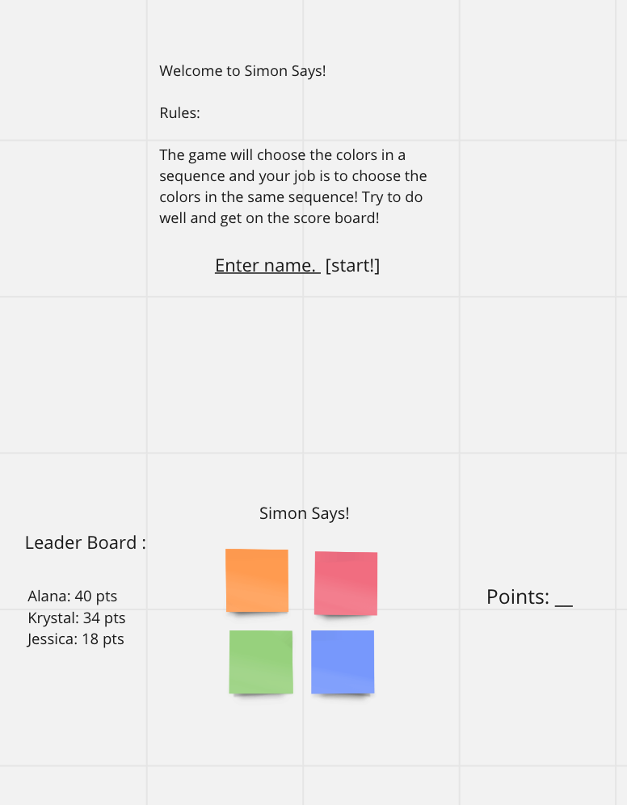

# Simon Says 

This is a simple Simon Says game where the player must match
the order that the game chooses colors.

I made a simple wireframe using Miro.com which can be seen below 

Goals: 
 - Simon will choose a random pattern and show the player 
 - Player earns a point for every pattern they match
 - Top players will have their score on the Leader Board 